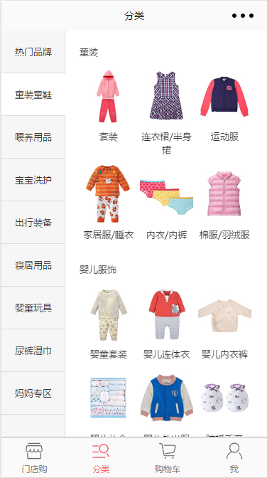
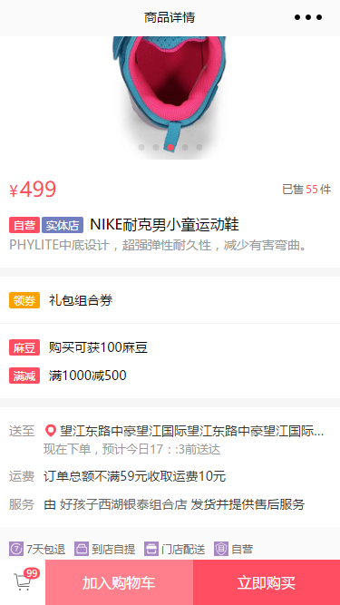
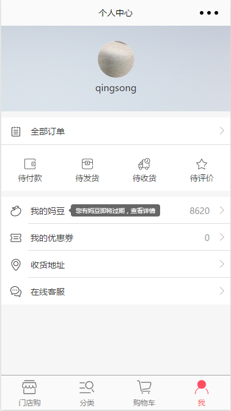

### 微信电商小程序

#### 一、 项目说明
微信小程序实现移动端商城系统示例。   

> 数据来源：妈妈好微信小程序(小程序名：`妈妈好服务`)，特此声明。  

#### 二、目录结构

开发目录位于`src`目录下，如下表：

|目录或文件     |作用                                        |
|-----------   |-------------------------------------------|
| `components` | 小程序组件，可复用                          |
| `config`     | 项目配置文件                               |
| `images`     | 存放项目图片                               |
| `libs`       | 存放项目相关的第三方js库文件                 |
| `pages`      | 存放项目页面相关文件                        |
| `styles`     | 存放项目独立`wxss`样式文件，可`impoort`引入  |
| `utils`      | 存放`utils`文件，可`require`/`import`引入   |
| `app.js`     | 入口文件                                   |
| `app.json`   | 小程序公共配置                              |
| `app.wxss`   | 小程序公共样式表                            |
     

**[开发注意事项]**
   
1 . 使用`es6`语法进行代码编写(在微信小程序支持的范围内)，引入`Promise`以及`co`库语法，处理异步回调；   
2 . `css`开发时可直接使用`px`作为单位，使用`gulp`替换`1px`为`2rpx`，提升开发效率；                 
3 . 关于静态资源，由于小程序文件体积限制，建议将`images`下的图片放在`cdn`服务器上，`coding`时直接使用`/images/xx.png`引用，构建时在`gulpfile.js`修改为`cdn`路径即可；     
4 . `gulp`构建时会将最终资源打包到`src`同级目录`dist`中，开发者工具调试时引入该路径即可。 


```js
//config
var cfg = {
    env: 'pro',  //生产环境or开发环境
    imgPath:{
        pro: 'http://cdn.example.com/image/',
        dev: 'http://dev.example.com/image/'
    }
};

//replace and clone
gulp.task('clone', ['clean'], function () {
    return gulp.src(['./src/**/*.*', '!./src/images/**'])
        .pipe(replace('/images/', ifElse(cfg.env === 'pro', function () {
            return cfg.imgPath.pro
        }, function () {
            return cfg.imgPath.dev
        })))  //更改图片引用路径
        .pipe(replace(/(\d+)px/gi, function (m, num) {
            return 2 * num + 'rpx';
        })) //替换1px为2rpx
        .pipe(gulp.dest('./dist'))
});
```
                                               
                                               
#### 三、项目截图
商品分类：   


商品详情：   


个人中心：   



#### 四、开发必备
1 . [微信开发者工具下载](https://mp.weixin.qq.com/debug/wxadoc/dev/devtools/download.html)
   
2 . [小程序开发参考文档](https://mp.weixin.qq.com/debug/wxadoc/dev/framework/MINA.html)

3 . 项目地址：[git@github.com:mmrxia/weapp-mall.git](git@github.com:mmrxia/weapp-mall.git) 
  
 
#### 五、其他说明
本项目提供小程序的一些开发思路和技术选型，涉及到项目敏感数据和配置相关均已屏蔽。   
欢迎大家提issue讨论交流。
